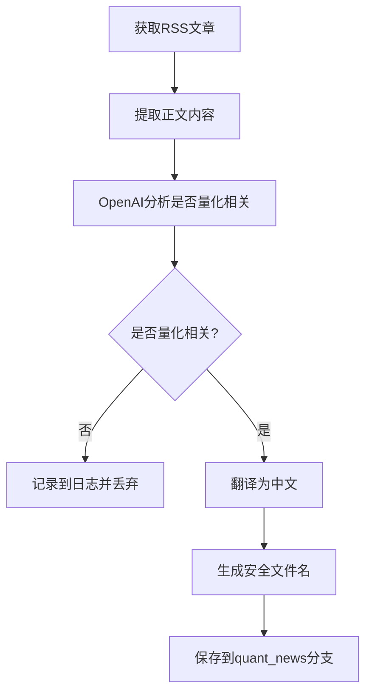

# 增强版新闻爬虫系统

## 🚀 新功能概述

增强版新闻爬虫专为自动化部署设计，具备以下核心功能：

1. **GitHub Actions 自动运行** - 每天UTC+8时间自动执行
2. **强制OpenAI分析** - 必须使用OpenAI API进行内容分析
3. **智能翻译** - 自动翻译英文文章为中文
4. **分支管理** - 自动保存到`quant_news`分支
5. **安全文件名** - 自动处理特殊字符和路径安全

## 📁 文件结构

```
.github/workflows/news-crawler.yml    # GitHub Actions工作流
scripts/enhanced_news_crawler.py      # 增强版爬虫主程序
scripts/test_enhanced_crawler.py      # 增强版测试脚本
```

## 🔧 配置要求

### 1. GitHub Secrets

在GitHub仓库设置中添加以下Secret：

```
OPENAI_API_KEY=your-openai-api-key
```

### 2. 依赖更新

新增依赖已添加到`pyproject.toml`：
- `python-slugify` - 安全文件名处理

## 🎯 工作流程

### 1. GitHub Actions 触发
- **定时触发**: 每天UTC+8 上午8:00 (UTC 00:00)
- **手动触发**: 在Actions页面手动运行

### 2. 文章处理流程



### 3. 文件组织

文章保存在`quant_news`分支中：
```
news/
├── 2025-06-22/
│   ├── quantitative-trading-strategies.md
│   ├── algorithmic-trading-systems.md
│   └── machine-learning-finance.md
├── 2025-06-23/
│   └── ...
```

## 📝 文章格式

每篇保存的文章包含：

```markdown
# 文章标题（翻译后）

**来源**: Reuters Business  
**原文链接**: https://example.com/article  
**发布时间**: 2025-06-22 10:30:00  
**抓取时间**: 2025-06-22 08:00:00  
**分析理由**: 文章涉及算法交易策略和量化投资技术

---

翻译后的文章内容...

---

*本文由AI自动翻译，如有错误请以原文为准。*
```

## 🧪 测试

### 本地测试

```bash
# 测试增强版爬虫
./scripts/run_news_crawler.sh test-enhanced

# 运行增强版爬虫（需要OpenAI API Key）
export OPENAI_API_KEY=your-api-key
./scripts/run_news_crawler.sh enhanced-crawl
```

### 测试项目

1. ✅ 依赖库检查
2. ✅ 文件名安全处理
3. ✅ OpenAI API连接
4. ✅ 爬虫初始化
5. ✅ RSS源解析

## 🔍 OpenAI分析标准

### 量化交易相关内容包括：

- ✅ 算法交易策略和技术
- ✅ 程序化交易系统
- ✅ 高频交易技术
- ✅ 因子投资和多因子模型
- ✅ 风险管理模型和技术
- ✅ 回测分析和策略验证
- ✅ 机器学习在金融中的应用
- ✅ 量化投资工具和平台
- ✅ 技术分析指标和模型
- ✅ 金融数据分析和挖掘
- ✅ 交易系统开发
- ✅ 金融工程和衍生品定价

### 不包括的内容：

- ❌ 一般性股票、基金投资新闻
- ❌ 公司财报和业绩报告
- ❌ 市场新闻和政策解读
- ❌ 宏观经济分析
- ❌ 个股推荐和分析

## 📊 统计信息

爬虫运行后会输出详细统计：

```
=== Crawling Statistics ===
Total articles processed: 50
Quant-related articles: 8
Non-quant articles: 42
Translation successful: 8
Translation failed: 0
Quant-related rate: 16.0%
```

## 🔧 故障排除

### 常见问题

1. **OpenAI API错误**
   - 检查API Key是否正确
   - 确认账户有足够余额
   - 检查网络连接

2. **文件名错误**
   - 系统自动使用slugify处理特殊字符
   - 空标题会使用URL hash生成

3. **分支创建失败**
   - 检查GitHub token权限
   - 确认仓库访问权限

### 调试模式

查看详细日志：
```bash
tail -f news_crawler.log
```

## 🚀 部署说明

1. **推送代码**到master分支
2. **设置GitHub Secret**: `OPENAI_API_KEY`
3. **启用GitHub Actions**
4. **手动触发**测试运行

系统将自动：
- 每天运行一次
- 创建`quant_news`分支（如果不存在）
- 保存量化相关文章
- 记录处理统计信息

## 📈 性能优化

- **请求延迟**: 默认2秒间隔，避免被限制
- **内容限制**: 文章内容限制在4000字符内进行翻译
- **批量处理**: 一次处理多个RSS源
- **错误恢复**: 单篇文章失败不影响整体流程

---

*增强版新闻爬虫 - 专为量化交易内容自动化收集设计*
