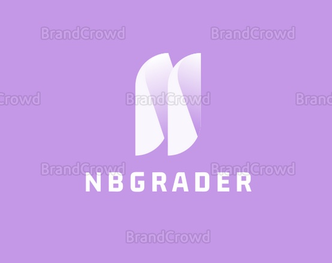
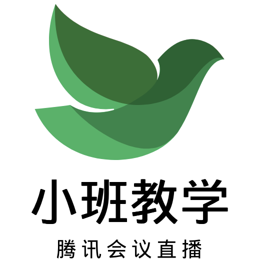

---

因子投資

與

機器學習策略

---

因子投资与机器学习策略

课程模块

1. 因子检验与 Alphalens

2. 因子挖掘 (400+)

3. 机器学习构建量化策略 (XGBoost)

Presented By: Aaron@QuanTide 

<!--blackboard-->

扫码加课程助教

前量化投资公司合伙人

Zillionare 开源量化框架作者

著有《Python 高效编程实践指南》

<!--instructor-info-->

<!--instructor-->

<!--wrapper-->

---

课程目标

🔍 会用 Alphalens 因子分析框架

📈 会看 Alphalens 报表和判定因子有效性

⛏️ 览遍 400+因子，掌握因子挖掘的方法和技术

💻 掌握机器学习、聚类模型、XGBoost 模型

Takeaway

📚 带走 350+因子实现

🧩 带走 Pair Trading 中性策略，聚类算法寻找配对资产

💰 带走基于 XGBoost 的资价格预测模型

💲 带走基于 XGBoost 的趋势交易模型

<!--wrapper-->

---

教学方式

<li>由 Slidev 驱动 演示从未如此动感十足又紧随焦点</li>
<li>Line Highligting 实现动画自由，牢牢跟随代码讲解</li>
<li>Notebook 嵌入运行，演示与 Notebook 紧密结合</li>

<!-- <v-drag-arrow color="red" width="3" class="abs top--80% left-60% opacity-20"/>
<v-drag class="abs top--80% left-60% w-30% h-200px opacity-20">
<Box />
<Ellipse/>
</v-drag> -->

<!--module-->

<li>作业也是 Notebook 格式，方便编辑和运行</li>
<li>作业自动分发，自主校验，定时提交，老师批改</li>
<li>老师评语，仅本人可见，彼此独立</li>

<!--module-->

<li>腾讯会议直播上课</li>
<li>会议录播，错过可回看</li>
<li>一对一辅导群，你的私人定制！</li>

<!--module-->

<li>咨询课程助理，选择课程</li>
<li>下单成功，通知课程助理创建专属课程环境</li>
<li>助理创建 1：1 辅导群，发送账号、通知上课时间</li>
<li>按时上课，及时完成作业和寻求辅导</li>
<li>两个月后，结束课程</li>

<!--module-->

<!--wrapper-->
