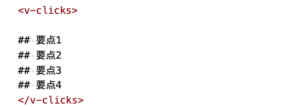
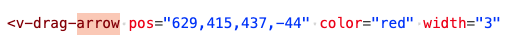
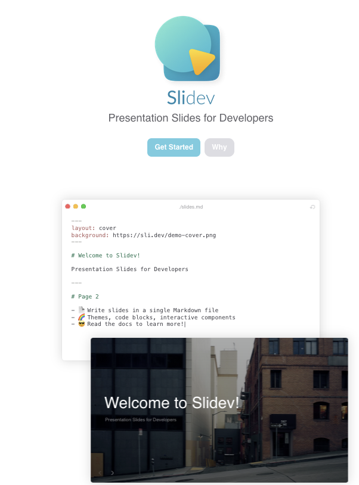

在教《量化 24 课》时，我们做好了几乎所有最重要的事：为每个学员构建了一个独立的课程环境，提供了 2005 年以来的全部行情数据（分钟级）、提供了回测引擎，只需要一个登录账号，就可以在浏览器中学习和运行策略。

但也有小小的遗憾，就是制作 PPT，特别是动画时，感到力不从心。

在演示代码时，我们常常要挑出其中的某几行精讲。理想情况下，是希望讲到某一行时，能将该行高亮显示，然后再进行讲解。

这在 PowerPoint 中，需要将代码先分成几个片段，然后进行排序，分别设置入场动画、出场动画。这些片段在页面中的排列定位就比较麻烦。如果分段过多，就变得事实上不可行。

所以，后来改用了一些屏幕涂鸦工具，把高亮改成手段框选。我使用的工具是 Mac 下的 Mark And Scribble。


这个软件接近完全免费，还挺好用的。不过用时候会手忙脚乱，也有时候会忘了使用这个工具。也就是，使用这个工具，生活就没有彩排，每一秒都是现场直播。

后来还试过 ipad 的手写，也没用出高级感来，手忙脚乱时，到处找该圈哪儿画哪儿也是有的。

不仅仅是动画，在 Power Point 中要对齐几个元素、特别是要均匀分布时，拖拖拽拽的总觉得很费时。这在网页制作中，用 CSS 可以很快解决。慢慢地，就发现了 Slidev。Slidev最大的优势就是，它允许我们使用Markdown语法来编写Slide。所以，创作Slides就非常快速，一个Markdown的大纲就是一个Slides。

比如，如果你要介绍一篇论文，只需要使用豆包提取大纲，将大纲按级别转成Markdown语法即可。这个过程完全可以自动化了。

## 唾手可得的代码高亮动画

再来看它如何解决了我们前面提到的代码逐行高亮问题。在Slidev中，它以一种简洁、易懂的语法扩展了Markdown：


```python
```python {4-5|7-9|all}
import numpy as np

g = np.random.random((5000,5000))
indx = np.random.randint(0,4999,(500,2))
g_nan = g.copy()
g_nan[indx] = np.nan
mask =  np.full((5000,5000),False,dtype=bool)
mask[indx] = True
g_mask = np.ma.array(g,mask=mask)
```

我们仅仅在 python之后加上了{4-5|7-9|all}，就引入了三个高亮动画，从而每点击一次鼠标，就会依次高亮不同的代码段。


很赞，毕竟我们只比平常多写了不到15个字符，就实现了三个高亮动画。


## 另一个常用动画

即使你的演示文稿不需要讲解代码，你也常常会遇到另外一种动画，即逐步显示大纲性文本。比如，我们的slide可能用4个要点，我们希望这4个要点不要一次性展示出来，而是讲到一个，就展示一个。

这个功能的实现在PowerPoint中要稍微容易一点，因为动作元素少。但在Slidev中，它会更简单：



当你按空格键时，它就会一次显示一个item，直到全部显示出来。这样就实现了我们想要的功能，但仍然保持着Markdown的可读性。


## 嵌入notebook

代码高亮方便了代码讲解，但有时候我们需要运行代码，查看结果，再修改、再运行。在之前使用PowerPoint的课程中，我们不得不跳转到新的窗口，运行一下，再跳转回来。这也会导致课程的讲述不够连贯。

由于Slidev是基于Web的，所以就很容易嵌入 Jupyter Notebook。下面的动图显示了在slide中嵌入notebook并运行的情况。


## V-drag: 可编辑的指示箭头和图形


开发者可能没有意识到，对他们来说是理所当然的事，在其它人的世界里，却并非显而易见。

要实现这种箭头，只需要如下定义一个任意箭头：



这里的pos的值不用在意，当这个箭头显示在屏幕上时，你就可以双击它，然后拖动它以修改坐标位置。坐标位置会同步回你的markdown文件并保存下来，下一次演示这个slides时，它就在你最后给它画地为牢时的位置。


好啦，似乎也没啥特别大不了的功能。但其实正是这些便利的地方，大大减轻了编写演示文稿时的工作负担，使得我们更愿意在演示文稿中使用动画和各种指示。

Slidev的功能远不止如此，在我们的课程中，你会看到更多的用法。最后，我们用官网的首页截屏来结束本文。这个图说明了简洁的Markdown文本，能渲染出多么惊艳的演示文稿 -- 借助Slidev。这很端庄，很得体。




