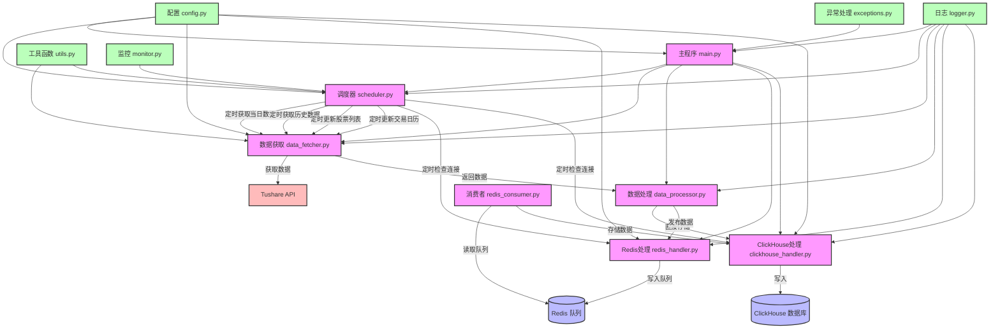

# 21 天驯化 AI 打工仔：开发量化交易系统（六）  日线数据的定时获取系统（基本架构实现）

"时间就是金钱，效率就是生命"，这句话在量化交易领域体现得淋漓尽致。今天是我和007合作的第六天，我决定要解决一个困扰我已久的问题：如何实现日线数据的自动定时获取？

"007，我需要一个可靠的系统，能够在每个交易日收盘后自动从Tushare获取当天的日线数据，并且在凌晨时分获取历史数据进行补充。这个系统必须足够智能，能够避免重复获取数据，还要能检查数据的完整性。"我对着屏幕说道。

007沉默了几秒钟，然后回答："收到🫡，这是一个典型的定时任务调度问题，我们需要设计一个完整的日线数据定时获取系统。"

## 系统设计的思考

在开始编码之前，我和007进行了深入的讨论，明确了系统的核心需求：

1. **定时获取能力**：在固定时间点自动执行数据获取任务
2. **数据完整性检查**：确保每一天的数据都是完整的
3. **智能跳过机制**：避免重复获取已有数据
4. **分批获取策略**：解决Tushare API调用限制问题
5. **异常处理机制**：处理网络波动、API限制等异常情况
6. **日志和监控**：记录系统运行状态，及时发现问题

"这个系统的架构应该如何设计？"我问道。

007展示了一个清晰的系统架构图：



"我们将系统分为多个模块，每个模块负责特定的功能，这样可以提高代码的可维护性和可扩展性。"007解释道，"配置模块负责管理系统配置，数据获取模块负责从Tushare获取数据，数据处理模块负责处理数据并发布到Redis或直接存储到ClickHouse，调度器模块负责管理定时任务，确保数据获取的可靠性。"

## 定时器的魔力

"定时器是整个系统的核心，"007继续说道，"我们将使用APScheduler库来实现定时任务调度。"

```python
from apscheduler.schedulers.background import BackgroundScheduler
from apscheduler.triggers.cron import CronTrigger
import pytz

scheduler = BackgroundScheduler(timezone=pytz.timezone('Asia/Shanghai'))

# 每个交易日15:30获取当日数据
scheduler.add_job(
    fetch_daily_data,
    CronTrigger(hour=15, minute=30, day_of_week='mon-fri'),
    id='daily_data_job',
    replace_existing=True
)

# 每天凌晨1:00获取历史数据
scheduler.add_job(
    fetch_historical_data,
    CronTrigger(hour=1, minute=0),
    id='historical_data_job',
    replace_existing=True
)

scheduler.start()
```

"这样设置后，系统会在每个工作日的15:30自动获取当日数据，在每天凌晨1:00自动获取历史数据。"007解释道。

## 数据完整性的保障

"但是，"我提出了一个关键问题，"如果某一天因为网络问题或者其他原因，数据获取失败了怎么办？"

007微微一笑："这就是为什么我们需要数据完整性检查机制。系统会定期检查ClickHouse中的数据，找出缺失的日期，然后自动补充这些数据。"

```python
def check_data_completeness(start_date, end_date):
    """检查数据完整性，找出缺失的日期"""
    # 获取交易日历
    trade_cal = get_trade_calendar(start_date, end_date)

    # 查询ClickHouse中已有的数据日期
    existing_dates = query_existing_dates(start_date, end_date)

    # 找出缺失的日期
    missing_dates = set(trade_cal) - set(existing_dates)

    return list(missing_dates)

def complete_missing_data():
    """补充缺失的数据"""
    # 获取最近30天的日期范围
    end_date = datetime.now().strftime('%Y%m%d')
    start_date = (datetime.now() - timedelta(days=30)).strftime('%Y%m%d')

    # 检查数据完整性
    missing_dates = check_data_completeness(start_date, end_date)

    if missing_dates:
        logger.info(f"发现缺失数据日期: {missing_dates}")
        for date in missing_dates:
            fetch_data_for_date(date)
    else:
        logger.info("数据完整性检查通过，无缺失数据")
```

"这个机制确保了即使某一天的数据获取失败，系统也能在后续的检查中发现并补充这些数据。"007补充道。

## 智能跳过已有数据

"重复获取数据会浪费API调用次数和系统资源，"我说，"我们需要一个智能跳过机制。"

007点点头："系统会在获取数据前先检查ClickHouse中是否已经存在该日期的数据，如果存在则跳过，只获取缺失的数据。"

```python
def fetch_historical_data(days=7, force=False):
    """获取历史数据，支持智能跳过已有数据"""
    end_date = datetime.now().strftime('%Y%m%d')
    start_date = (datetime.now() - timedelta(days=days)).strftime('%Y%m%d')

    if not force:
        # 检查已有数据，只获取缺失的日期
        missing_dates = check_data_completeness(start_date, end_date)
        if not missing_dates:
            logger.info(f"从 {start_date} 到 {end_date} 的数据已完整，跳过获取")
            return

        logger.info(f"智能获取缺失日期: {missing_dates}")
        for date in missing_dates:
            fetch_data_for_date(date)
    else:
        # 强制获取所有数据
        logger.info(f"强制获取从 {start_date} 到 {end_date} 的所有数据")
        fetch_data_for_date_range(start_date, end_date)
```

"这个机制大大提高了系统的效率，避免了不必要的API调用。"007说。

"由于我们在获取数据的时候已经确保输入的每个日期的数据都是完整的，所以我们这里也只需要判断时间区间即可。"我感叹道，“这个设计巧妙！”

## 分批获取的艺术

"Tushare API有调用限制，如果一次性获取所有股票的数据可能会超出限制，"我担忧地说。


"别担心，"007胸有成竹，"我们会实现分批获取策略，将股票列表分成多个批次，逐批获取数据。"

```python
def fetch_data_in_batches(date, batch_size=100):
    """分批获取数据，解决API调用限制问题"""
    # 获取股票列表
    stock_list = get_stock_list()

    # 计算批次数
    total_stocks = len(stock_list)
    batch_count = (total_stocks + batch_size - 1) // batch_size

    logger.info(f"开始分批获取 {date} 的数据，共 {total_stocks} 只股票，分 {batch_count} 批处理")

    for i in range(batch_count):
        start_idx = i * batch_size
        end_idx = min((i + 1) * batch_size, total_stocks)
        batch_stocks = stock_list[start_idx:end_idx]

        logger.info(f"处理第 {i+1}/{batch_count} 批，包含 {len(batch_stocks)} 只股票")

        # 获取这批股票的数据
        fetch_data_for_stocks(date, batch_stocks)

        # 适当休眠，避免API调用过于频繁
        if i < batch_count - 1:
            time.sleep(1)
```

"这个策略不仅解决了API调用限制问题，还提高了系统的稳定性。"007补充道。

## 实战测试

理论设计完成后，我迫不及待地想要看到系统的实际运行效果。

"让我们启动系统，看看它是如何工作的。"我说。

007执行了启动命令：

```bash
python main.py start
```

系统启动后，控制台输出了日志信息：

```
(course) (base) quantide@mini-one 日线数据定时获取 % python main.py start
2025-05-21 14:23:38,748 - day_bar_fetcher - INFO - Redis连接成功
2025-05-21 14:23:38,791 - day_bar_fetcher - INFO - ClickHouse连接成功
2025-05-21 14:23:38,807 - day_bar_fetcher - INFO - 已确保表 RealTime_DailyLine_DB.day_bar 存在
2025-05-21 14:23:38,807 - day_bar_fetcher - INFO - 调度器初始化成功
2025-05-21 14:23:38,808 - day_bar_fetcher - INFO - 正在启动日线数据定时获取系统...
2025-05-21 14:23:38,808 - day_bar_fetcher - INFO - 已添加所有定时任务
2025-05-21 14:23:38,809 - day_bar_fetcher - INFO - 调度器已启动
2025-05-21 14:23:38,809 - day_bar_fetcher - INFO - 系统已启动，按Ctrl+C终止
```

"太棒了！系统成功启动，并且已经添加了所有定时任务。"我兴奋地说。

为了测试系统的功能，我决定手动触发一次当日数据获取：

```bash
python main.py daily
```

系统立即开始工作：

```
(course) (base) mini-one:日线数据定时获取 quantide$ python main.py daily
2025-05-21 16:55:37,018 - day_bar_fetcher - INFO - Tushare API初始化成功
2025-05-21 16:55:37,038 - day_bar_fetcher - INFO - Redis连接成功
2025-05-21 16:55:37,099 - day_bar_fetcher - INFO - ClickHouse连接成功
2025-05-21 16:55:37,103 - day_bar_fetcher - INFO - 已确保表 RealTime_DailyLine_DB.day_bar 存在
2025-05-21 16:55:37,104 - day_bar_fetcher - INFO - 调度器初始化成功
2025-05-21 16:55:37,105 - day_bar_fetcher - INFO - 手动获取当日数据
2025-05-21 16:55:37,764 - day_bar_fetcher - INFO - 获取日线数据，日期: 20250521, 股票代码: 所有
2025-05-21 16:55:37,764 - day_bar_fetcher - INFO - 获取股票列表...
2025-05-21 16:55:38,530 - day_bar_fetcher - INFO - 获取股票列表成功，共 5416 条记录
2025-05-21 16:55:38,540 - day_bar_fetcher - INFO - 日期 20250521 在ClickHouse中已有 0 个股票的数据
2025-05-21 16:55:38,540 - day_bar_fetcher - INFO - 日期 20250521 没有已存在的数据，需要获取 5416 个股票的数据
2025-05-21 16:55:38,540 - day_bar_fetcher - INFO - 获取日线数据，日期: 20250521, 批次: 1/6, 股票数量: 1000
2025-05-21 16:55:39,025 - day_bar_fetcher - INFO - 批次 1 获取成功，共 993 条记录
2025-05-21 16:55:39,025 - day_bar_fetcher - INFO - 获取日线数据，日期: 20250521, 批次: 2/6, 股票数量: 1000
...
2025-05-21 16:55:42,125 - day_bar_fetcher - INFO - 获取日线数据成功，共 5390 条记录
2025-05-21 16:55:42,125 - day_bar_fetcher - INFO - 开始处理并存储 5390 条数据
2025-05-21 16:55:42,151 - day_bar_fetcher - INFO - 已插入 1000 条数据到ClickHouse表 RealTime_DailyLine_DB.day_bar
...
RealTime_DailyLine_DB.day_bar
2025-05-21 16:55:42,372 - day_bar_fetcher - INFO - 已处理并存储 5390/5390 条数据
2025-05-21 16:55:42,373 - day_bar_fetcher - INFO - 数据处理和存储完成，共 5390 条记录
2025-05-21 16:55:42,373 - day_bar_fetcher - INFO - 检查并补充日期 20250521 的数据
2025-05-21 16:55:42,407 - day_bar_fetcher - INFO - 日期 20250521 在ClickHouse中共有 5390 个股票的数据
2025-05-21 16:55:42,418 - day_bar_fetcher - INFO - 日期 20250521 数据完整度: 99.93% (5390/5394), 是否完整: True
2025-05-21 16:55:42,419 - day_bar_fetcher - INFO - 日期 20250521 的数据已完整，无需补充
2025-05-21 16:55:42,419 - day_bar_fetcher - INFO - 当日数据获取完成
2025-05-21 16:55:42,426 - day_bar_fetcher - INFO - ==================================================
2025-05-21 16:55:42,426 - day_bar_fetcher - INFO - ClickHouse中已有数据的时间范围: 20250514 - 20250521
2025-05-21 16:55:42,429 - day_bar_fetcher - INFO - ClickHouse中共有 32344 条数据记录
2025-05-21 16:55:42,429 - day_bar_fetcher - INFO - ==================================================
```

"系统运行得非常好，"我赞叹道，"它成功获取了当日的数据，并且详细记录了处理过程。"

"当然，如果你对获取数据的完整性依旧放心不下，我们可以运行`python main.py complete`或`python main.py info`来检查我们已经存储的数据信息。"，007 补充道。

说罢，007 执行了以下命令：
```
python main.py complete
```

系统显示了如下 Clickhouse 的信息：

```
2025-05-22 09:40:17,208 - day_bar_fetcher - INFO - Tushare API初始化成功
2025-05-22 09:40:17,259 - day_bar_fetcher - INFO - Redis连接成功
2025-05-22 09:40:17,410 - day_bar_fetcher - INFO - ClickHouse连接成功
2025-05-22 09:40:17,426 - day_bar_fetcher - INFO - 已确保表 RealTime_DailyLine_DB.day_bar 存在
2025-05-22 09:40:17,428 - day_bar_fetcher - INFO - 调度器初始化成功
2025-05-22 09:40:17,429 - day_bar_fetcher - INFO - 检查并补充日期范围 最早 - 最新 的数据
2025-05-22 09:40:17,479 - day_bar_fetcher - INFO - 日期 20250514 在ClickHouse中共有 5391 个股票的数据
2025-05-22 09:40:17,483 - day_bar_fetcher - INFO - 日期 20250514 数据完整度: 99.94% (5391/5394), 是否完整: True
2025-05-22 09:40:17,485 - day_bar_fetcher - INFO - 日期 20250515 在ClickHouse中共有 5390 个股票的数据
2025-05-22 09:40:17,488 - day_bar_fetcher - INFO - 日期 20250515 数据完整度: 99.93% (5390/5394), 是否完整: True
2025-05-22 09:40:17,490 - day_bar_fetcher - INFO - 日期 20250516 在ClickHouse中共有 5391 个股票的数据
2025-05-22 09:40:17,494 - day_bar_fetcher - INFO - 日期 20250516 数据完整度: 99.94% (5391/5394), 是否完整: True
2025-05-22 09:40:17,498 - day_bar_fetcher - INFO - 日期 20250519 在ClickHouse中共有 5388 个股票的数据
2025-05-22 09:40:17,501 - day_bar_fetcher - INFO - 日期 20250519 数据完整度: 99.89% (5388/5394), 是否完整: True
2025-05-22 09:40:17,503 - day_bar_fetcher - INFO - 日期 20250520 在ClickHouse中共有 5394 个股票的数据
2025-05-22 09:40:17,507 - day_bar_fetcher - INFO - 日期 20250520 数据完整度: 100.00% (5394/5394), 是否完整: True
2025-05-22 09:40:17,510 - day_bar_fetcher - INFO - 日期 20250521 在ClickHouse中共有 5390 个股票的数据
2025-05-22 09:40:17,512 - day_bar_fetcher - INFO - 日期 20250521 数据完整度: 99.93% (5390/5394), 是否完整: True
2025-05-22 09:40:17,512 - day_bar_fetcher - INFO - 日期范围 20250514 - 20250521 内共有 0 个不完整的日期
2025-05-22 09:40:17,512 - day_bar_fetcher - INFO - 所有日期的数据都已完整，无需补充
2025-05-22 09:40:17,515 - day_bar_fetcher - INFO - ==================================================
2025-05-22 09:40:17,515 - day_bar_fetcher - INFO - ClickHouse中已有数据的时间范围: 20250514 - 20250521
2025-05-22 09:40:17,517 - day_bar_fetcher - INFO - ClickHouse中共有 32344 条数据记录
2025-05-22 09:40:17,517 - day_bar_fetcher - INFO - ==================================================
```

为了保证系统的功能性，我们增加了一些参数来更好的使用该系统：

### 启动系统

```bash
python main.py start
```

### 手动获取当日数据

```bash
# 获取当日数据
python main.py daily

# 使用分批获取，每批100个股票
python main.py daily --batch-size 100
```

### 手动获取历史数据

```bash
# 获取最近7天的历史数据
python main.py history --days 7

# 获取指定日期范围的历史数据
python main.py history --start 20230101 --end 20230107

# 强制获取所有数据，不跳过已存在的数据
python main.py history --days 7 --force

# 使用分批获取，每批100个股票
python main.py history --days 7 --batch-size 100
```

### 检查并补充不完整的数据

```bash
# 检查并补充所有不完整的数据
python main.py complete

# 检查并补充指定日期的数据
python main.py complete --date 20230101

# 检查并补充指定日期范围的数据
python main.py complete --start 20230101 --end 20230107

# 使用分批获取，每批100个股票
python main.py complete --batch-size 100
```

### 显示数据信息

```bash
# 显示ClickHouse中的数据信息（时间范围和记录数量）
python main.py info
```

### 手动更新股票列表

```bash
python main.py stock_list
```

### 手动更新交易日历

```bash
python main.py trade_cal
```

### 手动检查连接

```bash
# 检查所有连接
python main.py check

# 只检查Redis连接
python main.py check --redis

# 只检查ClickHouse连接
python main.py check --clickhouse
```

## 成果与展望

经过一天的努力，我和007成功实现了日线数据定时获取系统。这个系统具有以下特点：

1. **可靠的定时执行**：在指定时间自动获取数据
2. **智能的数据管理**：避免重复获取，确保数据完整性
3. **高效的分批处理**：解决API调用限制问题
4. **完善的异常处理**：应对各种异常情况
5. **详细的日志记录**：方便监控和问题排查

"这个系统将大大减轻我们的工作负担，"我总结道，"不再需要手动获取数据，系统会自动完成所有工作。"

007补充道："而且，系统的模块化设计使得我们可以轻松扩展其功能，比如添加更多的数据源、支持更多的数据类型等。"

"接下来，我们可以考虑将这个系统与我们之前开发的其他模块集成，构建一个完整的量化交易平台。"我展望未来。

"没问题，"007自信地说，"有了这个可靠的数据基础，我们可以更专注于策略开发和回测优化。"

夜幕降临，我关闭了电脑，心中充满了成就感。21天的挑战已经过去了六天，我和007的合作越来越默契，量化交易系统也在一步步成型。明天，我们将继续前进，迎接新的挑战！


## 总结

日线数据定时获取系统是量化交易平台的重要基础设施，它确保了数据的及时性和完整性。通过精心设计的架构和算法，我们实现了一个高效、可靠的系统，为后续的策略开发和回测提供了坚实的数据支持。

这个系统不仅解决了数据获取的问题，还体现了软件工程的优秀实践：模块化设计、异常处理、日志记录、配置管理等。这些实践使得系统具有良好的可维护性和可扩展性，能够适应未来的需求变化。

观察到上图的表中仍然有部分字段存在问题，我们将在下一章节进行修复。敬请期待～

