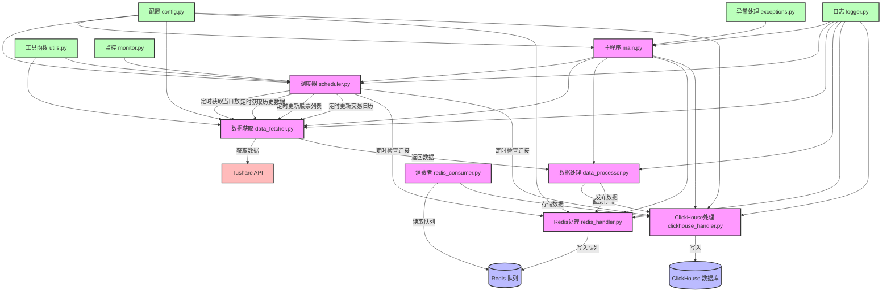

In quantitative trading, "time is money, and efficiency is life" is more than a slogan—it’s the operational reality. On the sixth day of my collaboration with 007, I decided to tackle a persistent challenge: automating the scheduled retrieval of daily bar data.

"007, I need a reliable system that automatically fetches today’s daily bar data from Tushare after each trading day’s close, and supplements historical data during the early morning hours. It must be intelligent enough to avoid redundant fetches and verify data integrity." I said to the screen.

007 paused for a few seconds before replying, "Received 🫡. This is a classic scheduled task scheduling problem. We need to design a complete daily bar data retrieval system."

## System Architecture Design

Before writing code, 007 and I engaged in a deep discussion to define the system’s core requirements:

1. **Scheduled Execution**: Automatically execute data retrieval tasks at fixed times.
2. **Data Integrity Verification**: Ensure daily data is complete.
3. **Smart Skip Mechanism**: Avoid re-fetching existing data.
4. **Batch Processing Strategy**: Address Tushare API rate limits.
5. **Exception Handling**: Manage network fluctuations and API restrictions.
6. **Logging and Monitoring**: Record system status and flag issues promptly.

"How should we architect this system?" I asked.

007 presented a clear system architecture diagram:



"We’ve divided the system into multiple modules, each responsible for specific functions, to improve code maintainability and scalability," 007 explained. "The configuration module manages system settings, the data acquisition module fetches data from Tushare, the data processing module handles data publishing to Redis or direct storage in ClickHouse, the scheduler module manages cron jobs to ensure reliable data retrieval."

## The Power of Scheduling

"The scheduler is the core of the system," 007 continued. "We will use the APScheduler library to implement task scheduling."

```python
from apscheduler.schedulers.background import BackgroundScheduler
from apscheduler.triggers.cron import CronTrigger
import pytz

scheduler = BackgroundScheduler(timezone=pytz.timezone('Asia/Shanghai'))

# 每个交易日15:30获取当日数据
scheduler.add_job(
    fetch_daily_data,
    CronTrigger(hour=15, minute=30, day_of_week='mon-fri'),
    id='daily_data_job',
    replace_existing=True
)

# 每天凌晨1:00获取历史数据
scheduler.add_job(
    fetch_historical_data,
    CronTrigger(hour=1, minute=0),
    id='historical_data_job',
    replace_existing=True
)

scheduler.start()
```

"With this configuration, the system will automatically fetch today’s data at 15:30 on each working day and retrieve historical data at 1:00 AM daily," 007 explained.

## Ensuring Data Integrity

"But," I raised a critical question, "what happens if data acquisition fails on a given day due to network issues or other reasons?"

007 smiled slightly. "That’s why we need a data integrity verification mechanism. The system will periodically check data in ClickHouse, identify missing dates, and automatically supplement them."

```python
def check_data_completeness(start_date, end_date):
    """检查数据完整性，找出缺失的日期"""
    # 获取交易日历
    trade_cal = get_trade_calendar(start_date, end_date)

    # 查询ClickHouse中已有的数据日期
    existing_dates = query_existing_dates(start_date, end_date)

    # 找出缺失的日期
    missing_dates = set(trade_cal) - set(existing_dates)

    return list(missing_dates)

def complete_missing_data():
    """补充缺失的数据"""
    # 获取最近30天的日期范围
    end_date = datetime.now().strftime('%Y%m%d')
    start_date = (datetime.now() - timedelta(days=30)).strftime('%Y%m%d')

    # 检查数据完整性
    missing_dates = check_data_completeness(start_date, end_date)

    if missing_dates:
        logger.info(f"发现缺失数据日期: {missing_dates}")
        for date in missing_dates:
            fetch_data_for_date(date)
    else:
        logger.info("数据完整性检查通过，无缺失数据")
```

"This mechanism ensures that even if data acquisition fails on a specific day, the system will detect and supplement it during subsequent checks," 007 added.

## Smart Skipping of Existing Data

"Re-fetching data wastes API calls and system resources," I said. "We need a smart skip mechanism."

007 nodded. "The system will first check if data for a given date already exists in ClickHouse. If it does, the system skips it and only fetches missing data."

```python
def fetch_historical_data(days=7, force=False):
    """获取历史数据，支持智能跳过已有数据"""
    end_date = datetime.now().strftime('%Y%m%d')
    start_date = (datetime.now() - timedelta(days=days)).strftime('%Y%m%d')

    if not force:
        # 检查已有数据，只获取缺失的日期
        missing_dates = check_data_completeness(start_date, end_date)
        if not missing_dates:
            logger.info(f"从 {start_date} 到 {end_date} 的数据已完整，跳过获取")
            return

        logger.info(f"智能获取缺失日期: {missing_dates}")
        for date in missing_dates:
            fetch_data_for_date(date)
    else:
        # 强制获取所有数据
        logger.info(f"强制获取从 {start_date} 到 {end_date} 的所有数据")
        fetch_data_for_date_range(start_date, end_date)
```

"This mechanism significantly improves system efficiency by avoiding unnecessary API calls," 007 said.

"Since we ensure that the data for each input date is complete during acquisition, we only need to check the time interval here," I remarked. "Clever design!"

## The Art of Batch Processing

"The Tushare API has call limits. Fetching data for all stocks at once might exceed these limits," I worried.


"Don’t worry," 007 said confidently. "We will implement a batch processing strategy, dividing the stock list into multiple batches and fetching data sequentially."

```python
def fetch_data_in_batches(date, batch_size=100):
    """分批获取数据，解决API调用限制问题"""
    # 获取股票列表
    stock_list = get_stock_list()

    # 计算批次数
    total_stocks = len(stock_list)
    batch_count = (total_stocks + batch_size - 1) // batch_size

    logger.info(f"开始分批获取 {date} 的数据，共 {total_stocks} 只股票，分 {batch_count} 批处理")

    for i in range(batch_count):
        start_idx = i * batch_size
        end_idx = min((i + 1) * batch_size, total_stocks)
        batch_stocks = stock_list[start_idx:end_idx]

        logger.info(f"处理第 {i+1}/{batch_count} 批，包含 {len(batch_stocks)} 只股票")

        # 获取这批股票的数据
        fetch_data_for_stocks(date, batch_stocks)

        # 适当休眠，避免API调用过于频繁
        if i < batch_count - 1:
            time.sleep(1)
```

"This strategy not only resolves API call limits but also improves system stability," 007 added.

## Live Testing

After completing the theoretical design, I couldn’t wait to see the system in action.

"Let’s start the system and see how it works," I said.

007 executed the startup command:

```bash
python main.py start
```

After the system started, the console output log information:

```
(course) (base) quantide@mini-one 日线数据定时获取 % python main.py start
2025-05-21 14:23:38,748 - day_bar_fetcher - INFO - Redis连接成功
2025-05-21 14:23:38,791 - day_bar_fetcher - INFO - ClickHouse连接成功
2025-05-21 14:23:38,807 - day_bar_fetcher - INFO - 已确保表 RealTime_DailyLine_DB.day_bar 存在
2025-05-21 14:23:38,807 - day_bar_fetcher - INFO - 调度器初始化成功
2025-05-21 14:23:38,808 - day_bar_fetcher - INFO - 正在启动日线数据定时获取系统...
2025-05-21 14:23:38,808 - day_bar_fetcher - INFO - 已添加所有定时任务
2025-05-21 14:23:38,809 - day_bar_fetcher - INFO - 调度器已启动
2025-05-21 14:23:38,809 - day_bar_fetcher - INFO - 系统已启动，按Ctrl+C终止
```

"Fantastic! The system started successfully, and all scheduled tasks have been added," I exclaimed.

To test the system’s functionality, I decided to manually trigger a daily data fetch:

```bash
python main.py daily
```

The system immediately began working:

```
(course) (base) mini-one:日线数据定时获取 quantide$ python main.py daily
2025-05-21 16:55:37,018 - day_bar_fetcher - INFO - Tushare API初始化成功
2025-05-21 16:55:37,038 - day_bar_fetcher - INFO - Redis连接成功
2025-05-21 16:55:37,099 - day_bar_fetcher - INFO - ClickHouse连接成功
2025-05-21 16:55:37,103 - day_bar_fetcher - INFO - 已确保表 RealTime_DailyLine_DB.day_bar 存在
2025-05-21 16:55:37,104 - day_bar_fetcher - INFO - 调度器初始化成功
2025-05-21 16:55:37,105 - day_bar_fetcher - INFO - 手动获取当日数据
2025-05-21 16:55:37,764 - day_bar_fetcher - INFO - 获取日线数据，日期: 20250521, 股票代码: 所有
2025-05-21 16:55:37,764 - day_bar_fetcher - INFO - 获取股票列表...
2025-05-21 16:55:38,530 - day_bar_fetcher - INFO - 获取股票列表成功，共 5416 条记录
2025-05-21 16:55:38,540 - day_bar_fetcher - INFO - 日期 20250521 在ClickHouse中已有 0 个股票的数据
2025-05-21 16:55:38,540 - day_bar_fetcher - INFO - 日期 20250521 没有已存在的数据，需要获取 5416 个股票的数据
2025-05-21 16:55:38,540 - day_bar_fetcher - INFO - 获取日线数据，日期: 20250521, 批次: 1/6, 股票数量: 1000
2025-05-21 16:55:39,025 - day_bar_fetcher - INFO - 批次 1 获取成功，共 993 条记录
2025-05-21 16:55:39,025 - day_bar_fetcher - INFO - 获取日线数据，日期: 20250521, 批次: 2/6, 股票数量: 1000
...
2025-05-21 16:55:42,125 - day_bar_fetcher - INFO - 获取日线数据成功，共 5390 条记录
2025-05-21 16:55:42,125 - day_bar_fetcher - INFO - 开始处理并存储 5390 条数据
2025-05-21 16:55:42,151 - day_bar_fetcher - INFO - 已插入 1000 条数据到ClickHouse表 RealTime_DailyLine_DB.day_bar
...
RealTime_DailyLine_DB.day_bar
2025-05-21 16:55:42,372 - day_bar_fetcher - INFO - 已处理并存储 5390/5390 条数据
2025-05-21 16:55:42,373 - day_bar_fetcher - INFO - 数据处理和存储完成，共 5390 条记录
2025-05-21 16:55:42,373 - day_bar_fetcher - INFO - 检查并补充日期 20250521 的数据
2025-05-21 16:55:42,407 - day_bar_fetcher - INFO - 日期 20250521 在ClickHouse中共有 5390 个股票的数据
2025-05-21 16:55:42,418 - day_bar_fetcher - INFO - 日期 20250521 数据完整度: 99.93% (5390/5394), 是否完整: True
2025-05-21 16:55:42,419 - day_bar_fetcher - INFO - 日期 20250521 的数据已完整，无需补充
2025-05-21 16:55:42,419 - day_bar_fetcher - INFO - 当日数据获取完成
2025-05-21 16:55:42,426 - day_bar_fetcher - INFO - ==================================================
2025-05-21 16:55:42,426 - day_bar_fetcher - INFO - ClickHouse中已有数据的时间范围: 20250514 - 20250521
2025-05-21 16:55:42,429 - day_bar_fetcher - INFO - ClickHouse中共有 32344 条数据记录
2025-05-21 16:55:42,429 - day_bar_fetcher - INFO - ==================================================
```

"The system is running smoothly," I praised. "It successfully fetched today’s data and logged the processing details in detail."

"Of course, if you’re still concerned about data completeness, we can run `python main.py complete` or `python main.py info` to check the stored data information," 007 added.

Then, 007 executed the following commands:
```
python main.py complete
```

The system displayed the following ClickHouse information:

```
2025-05-22 09:40:17,208 - day_bar_fetcher - INFO - Tushare API初始化成功
2025-05-22 09:40:17,259 - day_bar_fetcher - INFO - Redis连接成功
2025-05-22 09:40:17,410 - day_bar_fetcher - INFO - ClickHouse连接成功
2025-05-22 09:40:17,426 - day_bar_fetcher - INFO - 已确保表 RealTime_DailyLine_DB.day_bar 存在
2025-05-22 09:40:17,428 - day_bar_fetcher - INFO - 调度器初始化成功
2025-05-22 09:40:17,429 - day_bar_fetcher - INFO - 检查并补充日期范围 最早 - 最新 的数据
2025-05-22 09:40:17,479 - day_bar_fetcher - INFO - 日期 20250514 在ClickHouse中共有 5391 个股票的数据
2025-05-22 09:40:17,483 - day_bar_fetcher - INFO - 日期 20250514 数据完整度: 99.94% (5391/5394), 是否完整: True
2025-05-22 09:40:17,485 - day_bar_fetcher - INFO - 日期 20250515 在ClickHouse中共有 5390 个股票的数据
2025-05-22 09:40:17,488 - day_bar_fetcher - INFO - 日期 20250515 数据完整度: 99.93% (5390/5394), 是否完整: True
2025-05-22 09:40:17,490 - day_bar_fetcher - INFO - 日期 20250516 在ClickHouse中共有 5391 个股票的数据
2025-05-22 09:40:17,494 - day_bar_fetcher - INFO - 日期 20250516 数据完整度: 99.94% (5391/5394), 是否完整: True
2025-05-22 09:40:17,498 - day_bar_fetcher - INFO - 日期 20250519 在ClickHouse中共有 5388 个股票的数据
2025-05-22 09:40:17,501 - day_bar_fetcher - INFO - 日期 20250519 数据完整度: 99.89% (5388/5394), 是否完整: True
2025-05-22 09:40:17,503 - day_bar_fetcher - INFO - 日期 20250520 在ClickHouse中共有 5394 个股票的数据
2025-05-22 09:40:17,507 - day_bar_fetcher - INFO - 日期 20250520 数据完整度: 100.00% (5394/5394), 是否完整: True
2025-05-22 09:40:17,510 - day_bar_fetcher - INFO - 日期 20250521 在ClickHouse中共有 5390 个股票的数据
2025-05-22 09:40:17,512 - day_bar_fetcher - INFO - 日期 20250521 数据完整度: 99.93% (5390/5394), 是否完整: True
2025-05-22 09:40:17,512 - day_bar_fetcher - INFO - 日期范围 20250514 - 20250521 内共有 0 个不完整的日期
2025-05-22 09:40:17,512 - day_bar_fetcher - INFO - 所有日期的数据都已完整，无需补充
2025-05-22 09:40:17,515 - day_bar_fetcher - INFO - ==================================================
2025-05-22 09:40:17,515 - day_bar_fetcher - INFO - ClickHouse中已有数据的时间范围: 20250514 - 20250521
2025-05-22 09:40:17,517 - day_bar_fetcher - INFO - ClickHouse中共有 32344 条数据记录
2025-05-22 09:40:17,517 - day_bar_fetcher - INFO - ==================================================
```

To ensure the system’s functionality, we added some parameters to better utilize it:

### Start the System

```bash
python main.py start
```

### Manually Fetch Today’s Data

```bash
# 获取当日数据
python main.py daily

# 使用分批获取，每批100个股票
python main.py daily --batch-size 100
```

### Manually Fetch Historical Data

```bash
# 获取最近7天的历史数据
python main.py history --days 7

# 获取指定日期范围的历史数据
python main.py history --start 20230101 --end 20230107

# 强制获取所有数据，不跳过已存在的数据
python main.py history --days 7 --force

# 使用分批获取，每批100个股票
python main.py history --days 7 --batch-size 100
```

### Check and Supplement Incomplete Data

```bash
# 检查并补充所有不完整的数据
python main.py complete

# 检查并补充指定日期的数据
python main.py complete --date 20230101

# 检查并补充指定日期范围的数据
python main.py complete --start 20230101 --end 20230107

# 使用分批获取，每批100个股票
python main.py complete --batch-size 100
```

### Display Data Information

```bash
# 显示ClickHouse中的数据信息（时间范围和记录数量）
python main.py info
```

### Manually Update Stock List

```bash
python main.py stock_list
```

### Manually Update Trading Calendar

```bash
python main.py trade_cal
```

### Manually Check Connection

```bash
# 检查所有连接
python main.py check

# 只检查Redis连接
python main.py check --redis

# 只检查ClickHouse连接
python main.py check --clickhouse
```

## Results and Outlook

After a day’s effort, 007 and I successfully implemented the daily bar data scheduled retrieval system. This system features:

1. **Reliable Scheduled Execution**: Automatically fetches data at specified times.
2. **Smart Data Management**: Avoids redundant fetches and ensures data integrity.
3. **Efficient Batch Processing**: Resolves API call limits.
4. **Robust Exception Handling**: Addresses various abnormal situations.
5. **Detailed Logging**: Facilitates monitoring and troubleshooting.

"This system will significantly reduce our workload," I summarized. "No more manual data fetching; the system handles everything automatically."

007 added, "Moreover, the modular design allows us to easily extend its functionality, such as adding more data sources or supporting additional data types."

"Next, we can consider integrating this system with other modules we’ve previously developed to build a complete quantitative trading platform," I envisioned.

"No problem," 007 said confidently. "With this reliable data foundation, we can focus more on strategy development and backtest optimization."

As night fell, I closed my laptop, filled with a sense of accomplishment. Six days into the 21-day challenge, my collaboration with 007 is becoming increasingly seamless, and the quantitative trading system is taking shape step by step. Tomorrow, we will continue forward,迎接 new challenges!


## Summary

The daily bar data scheduled retrieval system is a critical infrastructure component of a quantitative trading platform, ensuring data timeliness and integrity. Through carefully designed architecture and algorithms, we have implemented an efficient and reliable system that provides solid data support for subsequent strategy development and backtesting.

This system not only solves the data acquisition problem but also embodies excellent software engineering practices: modular design, exception handling, logging, and configuration management. These practices ensure the system has good maintainability and scalability, adapting to future requirement changes.

Observing the table in the image above, we notice that some fields still have issues, which we will address in the next chapter. Stay tuned!


