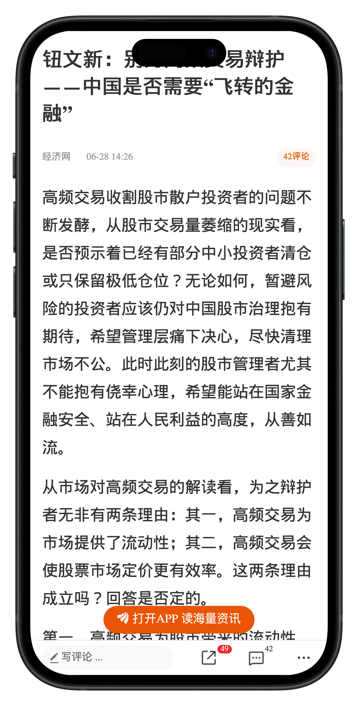

---
layout: prelude-brand-only
---

---
clicks: 10
---

<Anime :at=[0,1,2,3] class="abs top-100px w-full h-full"
    :enter="{scale: 0.8,rotateZ: '30deg'}"
    :click-1="{filter:'blur(6px)'}"
    dur="2s"
    action="fadeInLeft">
    
</Anime>

<SoarText class="absolute w-full h-full left-0 top-0" :offsetY = 200>
```md
周五盘后消息

某会就深化资本市场改革开展调研
钮文新发文建议

转融通做空以及量化交易不该在“规范”名义下被合法化

一石激起千层浪，消息很快就上了热搜。

民众对转融通和量化的情绪

主要来自于今年春节前的量化崩塌。
```
</SoarText>


<!--

周五盘后消息，某会就深化资本市场改革开展调研，钮文新发文建议，转融通做空以及量化交易不该在“规范”名义下被合法化。一石激起千层浪，消息很快就上了热搜。

民众对转融通和量化的情绪，主要来自于今年春节前的量化崩塌。

最近，刚刚出版的2023年中国量化投资白皮书，深度回顾和复盘了春节前后市场极端走势，还原了那场风暴和风暴中的量化交易。

-->
