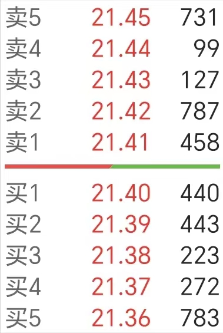
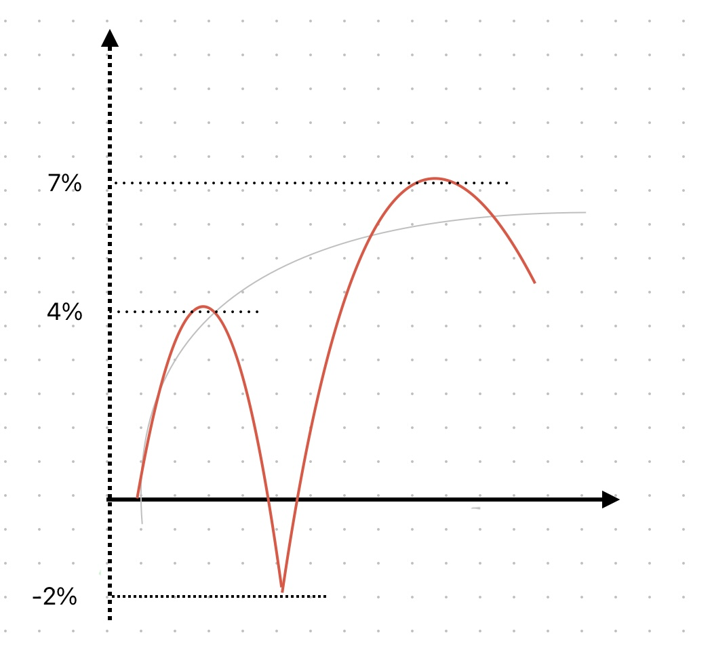

---
layout: prelude-brand-only
---

<!--量化风云，量化人的视听杂志-->

---
clicks: 20
img: https://images.jieyu.ai/images/hot/shanghai-extra-length.jpg
preload: false
---

    回测吃肉 实盘吃土

<Meme :at=1 left="350px" name="so-broken"/>

    限价单 Limit Order

    市价单 Market Order

    止盈止损单 Stop Order

    ⚔️

    定价单

    止盈单 Take Profit T/P

    止损单 Stop Loss S/L

    Once-cancels-the-other, OCO

    
止盈?

    
-2%止损

    

    
Order-Triggers-Order / OTO

    
Order-Triggers-Two/OTT

    
Trailing Stop

    
fill or kill

    
good-til-canceld

    
buy stop order

    
limit sell order

    
all-or-none

    
immediate-or-cancel

<Promotion :at=15 left="0" :dur=8 />

<!--
[click]1

回测有自己的局限，有一些订单类型在回测中实现不了。这会导致量化研究员对订单类型关注不多。但如果你不懂不同类型订单的作用，那就等着实盘遭受毒打吧。

我们先看最简单的两种订单类型，限价单和市价单。

[click]2

限价单是指定价格的订单，保证订单以指定价格、或者更好的价格成交。比如，你发出的是一个21.4元的委买限价单，则可能以21.4、或者更低的价格完成买入，但决不会高于21.4。反之，如果是卖出限价单，则可能以21.4、或者更高的价格成交，但决不会低于21.4。

[click]3

市价单是要求尽快能成交的订单。如果是委买单，则会从图中的卖一价格起，往价格上升的方向匹配委卖单，直到全部委买量匹配上、或者触及涨停价为止。

在集合竞价时，只能打限价单，不能打市价单。市价单会成为废单。

[click]4

接下来介绍称为 Stop Order的订单，中文翻译成止损止盈单。发出这种订单时，需要指定一个触发价格，当现价达到触发价格时，则以市价成交。看起来Stop order与限价单都有指定价格，两者有什么不同呢？

如果是限价8.5元的委卖单，则在当天股价上冲8.5元时，订单被执行，但不一定成交。成交多少，要看在这个价格上，有多少可匹配的委买单。但如果我们发出的是stop order的话，则系统会保证全部成交，只是可能一部分交易发生在价格回落的过程中，也就是可能低于指定价8.5元。

因此，在短线止盈止损中，Stop order就非常重要。它能向我们保证，只要价格曾经到过，就一键清仓。

[click]5

从Stop Order派生出来两种子类型，即take profit，常常缩写成TP和stop loss，常缩写为SL。你在量化回测软件，比如backtrader中，就会常常看到这两个词。

当然，如果你给backtrader提供的数据只有日线的话，那么stop order与限价单在效果上是不会有任何区别的。

[click]6

除了这几种订单之外，还存在一种组合订单，称为Once-cancels-the-other order,通常记作OCO。这种订单通常用来实现日内止盈和止损。

比如，如果你持有若干10元的某支股票，你希望在它上涨7%时卖出止盈，同时，万一发生下跌，则希望在下跌2%时卖出止损。此时就可以下一个OCO订单，即止盈又止损

[click]7

但我们不知道止损和止盈谁先到。在这个图中，-2%先到，所以

[click]8

止损单被执行，止盈单被取消。

[click]9

反之，如果我们的止盈单设置在4%，那么，这一次止盈单先执行，而止损单被同时取消。

在A股，这是普通的交易软件还不支持的一个功能。你可能遇到这样的情况，比如，当天满心期待地下了止盈单，但股票却开盘就往下走，来不及撤销止盈单，就已突破了止损位。但是，如果使用量化系统来交易，一般都会提供OCO订单，并且backtrader也实现了这种订单。

[click]10

除此之外，还有OTO,即一个订单触发另外一个订单。在当主订单被执行时，一个从属订单也被自动创建。比如，你可以在下跌5%处，创建一个买入的主订单，同时为该订单设置10%的止盈。如果主订单成功执行，则创建从属订单。如主订单被撤消，则从属订单也会撤消。

[click]11

基于OSO，还派生出来ott，即主订单执行时，触发另外两个从属订单的创建。两个从属订单一个是止盈，一个是止损。

[click]12

最后介绍一种跟踪订单，Trailing Stop。在A股常常有这样的情况，如果一支个股涨到7%之后，如果能成功封板，那么下跌的概率，差的时候也只有7成。但如果没有封板，那么最后可能变成冲高回落，后续可能还调整一段时间。

Trailing Stop就可以用在这种情况下，帮助我们锁定最大利润。比如，我们可以设置在超过7%的之后，如果继续上涨，则不进行操作，但一旦从高点回落1.5%，马上卖出。这种单就是Trailing Stop。

今天介绍了好几种订单，不过，这远远不是订单类型的全部。

[click]13
还有fill or kill, good-til-canceld, buy stop order, limit sell order, all-or-none, immediate-or-cancel等，就留给大家自己探索吧

这一期的内容就到这里，感谢观看。

做量化人的视听杂志，不用开电脑，轻松学量化
-->
