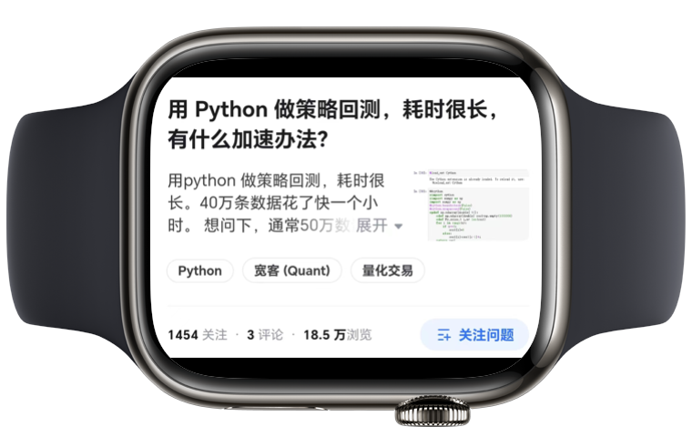
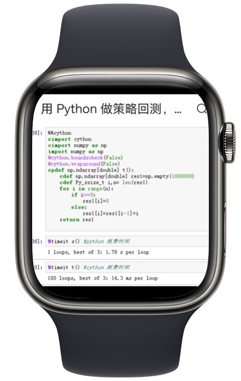

---
layout: prelude-brand-only
---

<!--
量化风云，量化人的视听杂志
-->

---
clicks: 20
---

<style scoped>

.watch {
    position:relative;
    filter: drop-shadow(0 10px 10px rgba(0, 0, 0, 0.3));
    height: auto;
    width: auto;
}

.circle {
    width: 700px;
    height: 700px;
    border-radius: 50%;
    background: linear-gradient(45deg, black, white);
    opacity: 0.5;
}

.text {
    text-align: center;
    text-shadow: 0 5px 10px rgba(0, 0, 0, 0.5);
}

.accl {
    position: relative;
    width: 1200px;
    left: -400px;
    right: 0;
    padding: 150px 0 0 0;
}

.items {
    left: 10%;
    top: 20%;
}
.items p {
    width: 500px;
    background-clip: content;
    background-image: url("https://images.jieyu.ai/images/hot/blue-purple-gradient.jpg");

    padding: 40px 40px 40px 20px;
    border-radius: 0 80px 80px 0;
}

.items :nth-child(2) {
    margin-top: 2rem;
    margin-left: 10%;
}

.items :nth-child(3) {
    margin-top: 2rem;
    margin-left: 20%;
}

.items :nth-child(4) {
    margin-top: 2rem;
    margin-left: 30%;
}
</style>

<div v-motion class="circle abs"
    :click-2="{scale:1,x:-350,y:520}"
    :click-3="{scale:1}"
    :click-8="{scale:0}"
    :enter="{scale:0,y:100}"/>

<div v-motion class="abs"
    :click-1="{scale:1,y:0}"
    :click-2="{scale:0.35,x:-330,y:450,rotate:'45deg'}"
    :click-8="{scale:0}"
    :enter="{scale:0,y:450,x:0, rotate:'0'}">

<p class="text" style="padding-bottom:50px">Python策略回测太慢</p>

<Audio :at=1 name="whoosh-2"/>
</div>

<div class="abs items">

<div v-motion
    :click-2="{scale:1}"
    :click-6="{y: -200}"
    :click-8="{scale:0}"
    :enter="{scale: 0}"
    >
    <p>Cython</p>
</div>

<div v-motion 
    :click-3="{scale:1}"
    :click-6="{scale:0}"
    :enter="{scale: 0}"
    >
    <p>Pypy/Numba</p>
</div>

<div v-motion 
    :click-4="{scale: 1}"
    :click-6="{scale:0}"
    :enter="{scale: 0}"
    >
<p>Ray/Dask</p>
</div>

<div v-motion 
    :click-5="{scale: 1}"
    :click-6="{scale:0}"
    :enter="{scale: 0}"
    >
<p>Swig/Pybind</p>
</div>
</div>


<div v-motion class="abs"
    :click-6="{scale:1}"
    :click-7="{scale:0}"
    :enter="{scale:0}">

```python
def s(n):
    res = np.empty(n)
    for i in range(n):
        if i == 0:
            res[i] = 0
        else:
            res[i] = res[i-1] + i
    return res
```

<div style="position:relative; left: 50%; top: 20px;color: cadetblue">

[0, 1, 3, 6, 10]

</div>
</div>


<div v-motion class="abs" style="top: 15%"
    :click-7="{scale:1}"
    :click-8="{scale:0}"
    :enter="{scale:0}">

````md magic-move {at: 7}
```python
def s(n):
    res = np.empty(n)
    for i in range(n):
        if i == 0:
            res[i] = 0
        else:
            res[i] = res[i-1] + i
    return res
```

```python
cimport cython
cimport numpy as np
import numpy as np
@python.boundscheck(False)
@cython.wraparound(False)
cpdef np.ndarray[double] t():
    cdef np.ndarray[double] res = np.empty(1_000_000)
    cdef Py_ssize_t i,n = len(res)
    for i in range(n):
        if i == 0:
            res[i] = 0
        else:
            res[i] = res[i-1] + i
    return res
```
````
</div>


<div v-motion class="abs" style="width: 400px;top:15%"
    :click-8="{scale:1, x:250, y:-50, rotate:0}"
    :click-9="{scale:0}"
    :enter= "{scale:0.35,x:-330,y:450,rotate:'45deg'}">



<p class="text accl"> 1.79s / 14.3ms => 125</p>
</div>

<div v-motion class="abs" style="top:15%"
    :click-9="{scale:1, y:-50, rotate:0}"
    :click-13="{scale:0}"
    :enter="{scale:0}">

````md magic-move {at:9}
```python
def s(n):
    res = np.empty(n)
    for i in range(n):
        if i == 0:
            res[i] = 0
        else:
            res[i] = res[i-1] + i
    return res
```
```python{all|7,12|13|all|all}
def s(n):
    res = np.empty(n)
    for i in range(n):
        if i == 0:
            res[i] = 0
        else:
            res[i] = res[i-1] + i
    return res

def t(n):
    a = np.arange(n)
    cumsum = np.cumsum(a)
    res = cumsum[:n-1] + a[1:]
    return np.concatenate(([0], res))

%timeit s(1_000_000)
%timeit t(1_000_000)
```
````
</div>

<div class="abs items" style="font-size: 4vw;padding:200px 0 0 100px"
    v-motion
    :click-12="{scale:1}"
    :click-13="{scale:0}"
    :enter="{scale:0,x:80}">

<p>627ms/4.82ms => 130</p>

</div>

<!--


在知乎上看到这样一个话题，用Python做策略回测，耗时很长，有什么加速办法？这个话题有18万浏览量，62个人提供了方案，看来Python的速度慢确实是大家关心的一个问题。

浏览了一下60多个回答，大致有这样一些方案。


首先是使用Cython。优点是，代码修改量少；缺点是要学习它的语法。如果要制作发行包，还要考虑跨平台问题。


其次是Pypy和Numba。使用这两种方案的主要问题都是兼容性问题。比如Pypy到目前为止，只支持Python 3.10。


第三种方法是Ray和Dask。虽然很强大，但作为优化方案有点过份了。它们完全是另外一个方案。你必须从头开始构建一切。chatGPT的后台就是基于Ray构建的，所以，这是一个非常强大，甚至超出你需要的方案。


如果你对c/c++非常熟，这倒不失为一个方案。要求你用c/c++写算法，然后编译成原生模块，再在python中导入使用。


最后，题主就根据大家的建议，用cython改写了算法，将性能提升了两个量级。

我们就来看一下他的优化方案


这是未优化前的代码。在这个函数中，如果n为5，那么应该输出 0, 1, 3, 6, 10。这段代码用了一个循环，因为Python的循环比较慢，所以题主对它的速度不太满意。

通过cython优化后，就可以大大加速。这是他修改后的代码。


我们看到cython对Python代码的侵入性不算太强，但对使用的每一个变量，都必须事先声明它的类型。这对习惯了使用type hint语法的人来说，倒也不是太大的问题。只不过两者语法差别比较大。


通过cython加速后，如果n取1百万，那么运行时间将减少两个量级，加速了125倍。


不过，如果你对Numpy和矩阵运算很熟悉的话，很多此类算法都没有必要借用其它工具。

这里我们直接使用Numpy给算法加速。上面的函数s是未加速的，下面的函数t是通过numpy向量化加速的


如何把一个python循环转化成向量化运算？

我们注意到第7行是把上一个函数值，加上当前迭代器值后，赋给现在的函数值。这相当于是一个递归。在Numpy中，以cum开头的函数，都有递归的味道，所以，我们很容易就想到要使用cumsum


第7行中的i来自于range，所以，我们想到使用np.arange也是很自然的事。所以，将Python循环转化为numpy向量化代码，非常容易。


最终我们发现， 加速比达到了130倍。达到这个效果，我们的代码甚至比原代码都还要简洁。


这一期的内容就到这里，感谢观看。

做量化人的视听杂志，不用开电脑，轻松学量化
-->
